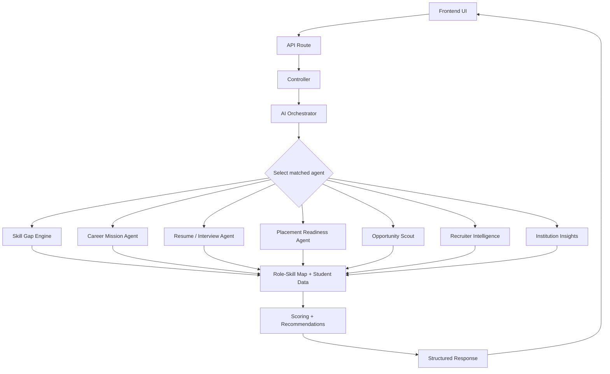

# Campus2Career

Campus2Career is a full-stack campus placement and career development platform designed for students, recruiters, mentors, institutions, and academic staff. It combines placement workflows, assessments, analytics, collaboration features, and an AI automation layer that helps students understand skill gaps, target roles, interview readiness, and career direction.

## Why Campus2Career

The platform goes beyond a simple job board. It creates a connected ecosystem where:

- Students can build profiles, apply for jobs, track applications, and get AI-guided career planning.
- Recruiters can post jobs, shortlist candidates, review applications, and assess talent.
- Mentors can approve progress and guide students through internships and milestones.
- Institutions can manage approvals, review portfolios, and track placement and skill trends.
- Academicians can publish faculty opportunities and participate in internship and program workflows.

The AI layer adds explainable automation for:

- role-based skill gap analysis
- placement readiness assessment
- opportunity scouting and fit ranking
- resume ATS analysis
- mock interview planning
- recruiter shortlist generation
- institution forecasting and cohort insights

---

## Tech Stack

| Layer | Stack |
|---|---|
| Frontend | React, Vite, React Router, Tailwind-style components, Lucide icons |
| Backend | Node.js, Express, MongoDB, Mongoose |
| Auth | JWT + refresh-token flow |
| AI Layer | Role-based orchestration services with explainable scoring logic |
| Generative AI | OpenAI-compatible / NVIDIA-style model integration |
| File Handling | Multer, XLSX, PDF parsing, document uploads |
| Real-Time | Server-sent events with notification streams |
| Deployment | Vercel + Render-ready configuration |

---

## Platform Workflow

### 1. Student workflow

A student can:

- create a profile and update skills, experience, projects, and resume
- explore jobs and internships
- apply for roles and track application status
- take assessments and aptitude tests
- review skill gap diagnostics
- generate a career mission for a target role
- understand readiness scores and next learning actions
- use resume intelligence and mock interview preparation
- access learning and opportunity recommendations

### 2. Recruiter workflow

A recruiter can:

- register and manage company profile
- create and publish jobs
- review applicants and applications
- shortlist candidates using AI ranking
- assess candidate quality using role-based scoring
- manage interview and hiring pipelines

### 3. Institution workflow

An institution can:

- review and approve programs, student evidence, and portfolios
- inspect skill demand and internship participation analytics
- view placement readiness and cohort-level indicators
- monitor institutional performance trends

### 4. Mentor and academician workflow

- mentors approve student milestones and internship progress
- academicians publish and manage opportunities and faculty-facing programs

### 5. Admin workflow

An admin can:

- verify jobs, users, and portfolios
- manage pathways, assessments, and question banks
- monitor analytics and system activity
- oversee institutional programs and collaboration data

---

## AI Automation Layer

The project contains an orchestration-based AI layer that routes requests to role-aware automation agents instead of a single monolithic AI service.

### Included automation modules

1. Career Mission Engine
   - generates a target role plan
   - checks role coverage and current readiness
   - highlights skill gaps
   - returns roadmap and learning recommendations

2. Skill Gap Engine
   - compares the student profile against target-role skill requirements
   - ranks strong vs. missing skills
   - outputs explainable recommendation blocks

3. Opportunity Scout
   - scores approved opportunities based on fit, role match, and student profile strength
   - ranks the best opportunity matches

4. Resume Intelligence
   - computes ATS-style score estimates
   - identifies missing keywords and weak sections
   - provides role-aligned recommendations

5. Mock Interview Agent
   - builds a practice interview plan for the target role
   - suggests domain questions, evaluation criteria, and readiness ranges

6. Recruiter Intelligence
   - ranks student candidates for a role
   - surfaces strongest fit profiles and shortlisting rationale

7. Placement Readiness Agent
   - evaluates skill coverage, profile completeness, project evidence, and academic consistency
   - returns readiness summaries and decision support

8. Institution Insights Agent
   - predicts cohort readiness and placement outcomes
   - creates department-level summaries and forecast insights

9. AI Command Center
   - provides an orchestrator overview of active AI agents and automation health
   - helps administrators see system readiness in one place

---

## AI Automation Workflow

The AI automation flow is built as an orchestrated system, not as one giant prompt. The request is routed through a central orchestrator that decides which specialized agent should process the user intent and what data should be used.

### Request flow

1. A student, recruiter, or institution user opens a page in the frontend and clicks a feature like AI Dashboard, Career Mission, Skill Gap, Resume Fit, or Placement Readiness.
2. The frontend calls a backend endpoint such as `/api/ai-automation/career/mission`, `/api/skill-gap/analysis`, or `/api/ai-automation/placement/readiness`.
3. The backend route receives the request and forwards it to the matching controller.
4. The controller calls the orchestrator service, which checks:
   - user role
   - requested action
   - target role or opportunity
   - available profile context
   - which AI agent is relevant
5. The orchestrator selects the correct agent such as:
   - Career Mission Agent
   - Skill Gap Engine
   - Opportunity Scout
   - Resume Interview Agent
   - Recruiter Intelligence Agent
   - Placement Readiness Agent
   - Institution Insights Agent
6. The selected agent reads the student or cohort data from the database, compares it against the role-skill map, and computes explainable scores.
7. The service then packages the result into a structured response with summary, recommendations, scores, missing skills, and next actions.
8. The frontend renders the AI insights in a dashboard or dedicated page.

### Core execution pattern



### How the intelligence is built

The system uses a role-based knowledge model rather than a generic one-size-fits-all AI approach:

- each target role has a skill map
- the student profile is compared against that map
- missing skills are prioritized by importance
- readiness is scored using profile completeness, project evidence, skills, and role alignment
- opportunities are ranked based on fit and current student profile
- recruiter evaluation uses role-specific matching and candidate strength

This makes the output explainable. Instead of giving a vague answer, the platform explains:

- what the student is already strong in
- what is missing for the target role
- how ready they are for placement
- what role or opportunity fits best
- what action should be taken next

### Example: student career mission workflow

A student may request a Data Analyst career mission:

1. The frontend sends the request with the target role and intent.
2. The orchestrator identifies the career mission flow.
3. The engine loads the student profile and role skill map.
4. It calculates current skill coverage, readiness, and missing priorities.
5. It generates a mission structure with:
   - target role
   - readiness score
   - key gap areas
   - action roadmap
   - recommended learning steps
6. The result is returned to the frontend and displayed as a personalized career plan.

### Logging and observability

Every major AI request is logged through the AI logging service. This stores:

- request type
- target role
- triggered agent
- timestamp
- response summary
- status and trace metadata

This gives administrators visibility into how the AI system is being used and helps troubleshoot issues in the automation layer.

---

## Project Structure

```text
Campus2Career/
├── backend/
│   ├── controllers/
│   ├── models/
│   ├── routes/
│   ├── services/
│   ├── scripts/
│   ├── tests/
│   ├── config/
│   ├── middleware/
│   ├── uploads/
│   ├── package.json
│   ├── server.js
│   └── ...
├── frontend/
│   ├── src/
│   ├── public/
│   ├── package.json
│   ├── vite.config.js
│   └── ...
├── recommendation_service/
│   ├── app.py
│   ├── ml_engine.py
│   ├── train_model.py
│   ├── dataset.csv
│   └── requirements.txt
├── README.md
├── TODO.md
├── render.yaml
├── LICENSE
└── CONTRIBUTING.md
```

---

## Core Roles

- student
- mentor
- recruiter
- admin
- institution
- academician

---

## Getting Started

### Prerequisites

- Node.js 18+
- MongoDB instance or MongoDB Atlas connection
- Python 3.10+ for the recommendation service (optional but recommended)

### 1) Clone the repository

```bash
git clone https://github.com/rahulyadav54/Campus2Career.git
cd Campus2Career
```

### 2) Backend setup

```bash
cd backend
npm install
```

Create a `.env` file in the backend folder. Example:

```bash
PORT=5000
MONGO_URI=mongodb://localhost:27017/campus2career
JWT_SECRET=your_secure_secret_here
FRONTEND_URLS=http://localhost:5173
OPENAI_API_KEY=your_key_here
OPENAI_BASE_URL=https://integrate.api.nvidia.com/v1
AI_MODEL=nemotron-4-340b-instruct
EMAIL_HOST=smtp.example.com
EMAIL_PORT=587
EMAIL_USER=example@example.com
EMAIL_PASS=your_password
```

Then start the backend:

```bash
npm start
```

Optional seed commands:

```bash
npm run seed:admin
npm run seed:demo
npm run seed:portal
```

### 3) Frontend setup

```bash
cd frontend
npm install
npm run dev
```

Frontend runs typically at:

```text
http://localhost:5173
```

### 4) Recommendation service (optional)

```bash
cd recommendation_service
python -m venv venv
source venv/bin/activate
pip install -r requirements.txt
python app.py
```

---

## Main API Areas

Base path: `/api`

### Authentication and access
- `/api/auth` — login, registration, refresh, profile
- `/api/student` — student-specific endpoints
- `/api/mentor` — mentor APIs
- `/api/recruiter` — recruiter APIs
- `/api/admin` — admin management and approvals
- `/api/institutions` — institution workflows and analytics

### Jobs and applications
- `/api/jobs` — job listing, creation, approval, updates
- `/api/applications` — application tracking and decisions
- `/api/opportunities` — academician and opportunity management
- `/api/recommendations` — recommendation APIs

### Learning and assessment
- `/api/assessments` — assessment handling
- `/api/student-assessments` — student attempts and results
- `/api/question-bank` — question bank management
- `/api/aptitude` — aptitude tests
- `/api/courses` — learning course records
- `/api/learning-platforms` — external platform integration

### Collaboration and community
- `/api/collaborations` — workshops, challenges, projects
- `/api/notifications` — notifications and unread state
- `/api/realtime` — live event or SSE stream
- `/api/chat-history` — AI chat persistence

### AI automation routes
- `/api/ai-automation` — orchestrator and automation endpoints
- `/api/skill-gap` — skill-gap analysis
- `/api/opportunity-scout` — opportunity fit scoring

---

## Frontend Routes

### Public
- `/`
- `/login`
- `/register`
- `/forgot-password`
- `/recruiter/register`
- `/academician/register`

### Student
- `/student`
- `/student/profile`
- `/student/jobs`
- `/student/recommendations`
- `/student/applications`
- `/student/certificates`
- `/student/portfolio`
- `/student/career`
- `/student/ai-dashboard`
- `/student/ai-career-mission`
- `/student/ai-skill-gap`
- `/student/skill-mapping`
- `/student/learning`
- `/student/learning-platforms`
- `/student/internships`
- `/student/workshops`
- `/student/challenges`
- `/student/projects`
- `/student/collaborations`
- `/student/notifications`
- `/student/courses`
- `/student/my-courses`

### Recruiter
- `/recruiter`
- `/recruiter/jobs`
- `/recruiter/create-job`
- `/recruiter/applications`
- `/recruiter/students`
- `/recruiter/analytics`
- `/recruiter/assessments`
- `/recruiter/notifications`

### Admin
- `/admin`
- `/admin/job-verification`
- `/admin/opportunity-approvals`
- `/admin/users`
- `/admin/analytics`
- `/admin/question-bank`
- `/admin/assessments`
- `/admin/courses`
- `/admin/notifications`

### Institution
- `/institution`
- `/institution/portfolio-verification`
- `/institution/analytics/skill-demand`
- `/institution/analytics/internship-participation`
- `/institution/analytics/placement-readiness`
- `/institution/notifications`

### Mentor / Academician
- `/mentor`
- `/mentor/mentees`
- `/mentor/progress`
- `/mentor/internships`
- `/academician`
- `/academician/opportunities`
- `/academician/applications`

---

## AI Workflow Example

### Student: career planning flow

1. Student opens the AI dashboard.
2. They choose or enter a target role such as Data Analyst or Product Analyst.
3. The AI system evaluates profile strength and skills.
4. It produces:
   - skill coverage %
   - missing priorities
   - role-fit explanation
   - curated roadmap
   - recommended learning actions
5. The student can then improve their resume and interview readiness using the supporting AI insights.

### Recruiter: shortlisting flow

1. Recruiter reviews a target role requirement.
2. The system ranks applicants by skills, profile strength, and role fit.
3. Recruiter receives a shortlist with explainable rationale.
4. Candidate quality becomes easier to compare and prioritize.

### Institution: forecasting flow

1. Institution looks at department readiness.
2. AI aggregates student cohort strengths and gaps.
3. It estimates readiness trends and forecast risk / opportunity areas.
4. Leadership can decide where to allocate training or intervention.

---

## Testing and Verification

The following checks were executed successfully during validation:

```bash
cd backend
node --test tests/*.test.js
```

Result:
- 10 tests passed
- 0 failed

Frontend validation:

```bash
cd frontend
npm run build
```

Result:
- Vite production build succeeded
- output ended with: "✓ built in 3.42s"

---

## Production Readiness Notes

The AI automation and app layers are functional and validated, but the overall project still has some roadmap items remaining before full production launch, including:

- reliability hardening for external services and database connectivity
- test coverage expansion and CI pipeline
- deployment configuration and security cleanup
- additional workflow completion for mentorship and collaboration modules

This README reflects the implemented state of the project and the current AI automation flow.

---

## Contributing

1. Create a feature branch.
2. Keep changes focused and well-documented.
3. Validate backend tests where relevant.
4. Validate frontend build before merge.
5. Update documentation when adding routes, workflows, or AI features.

---

## License

ISC